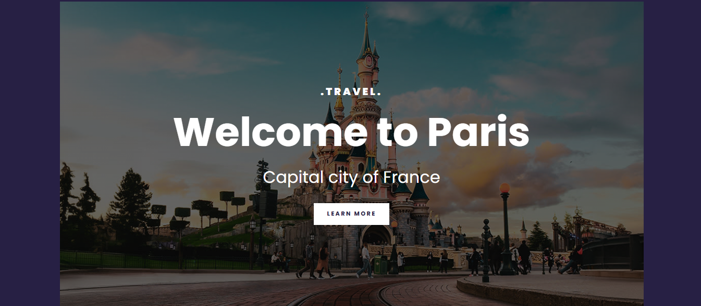
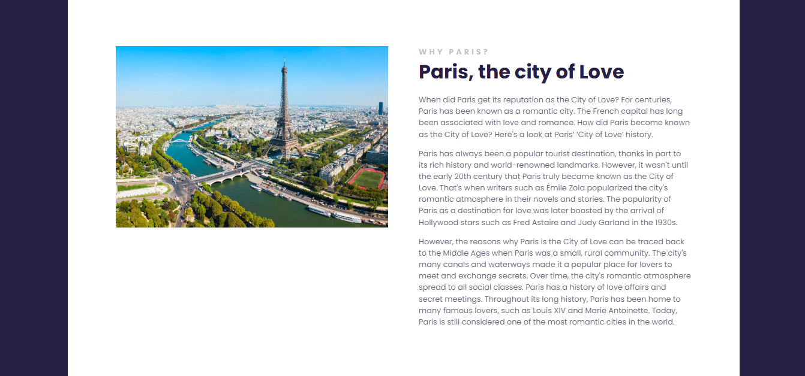
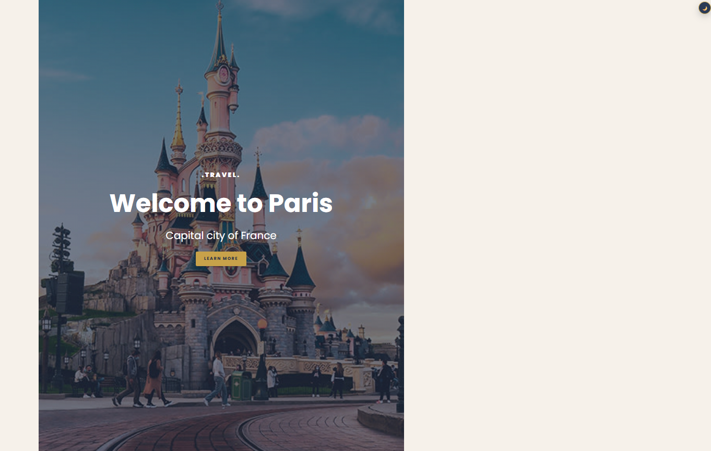
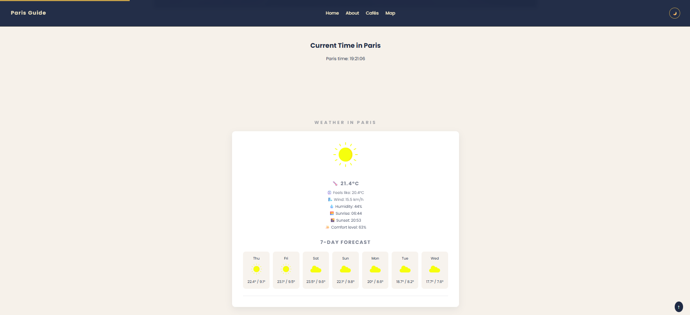
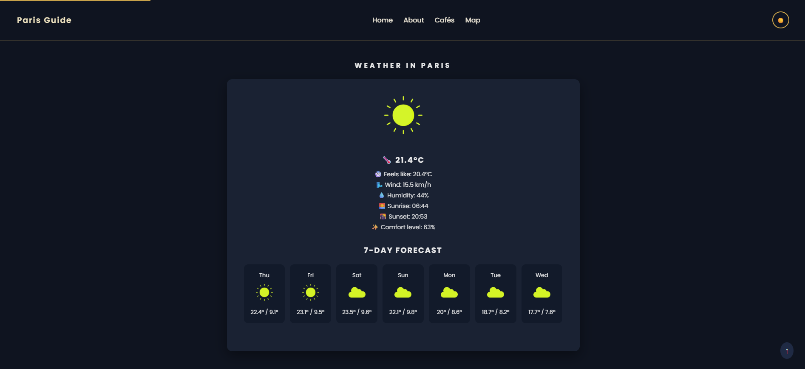
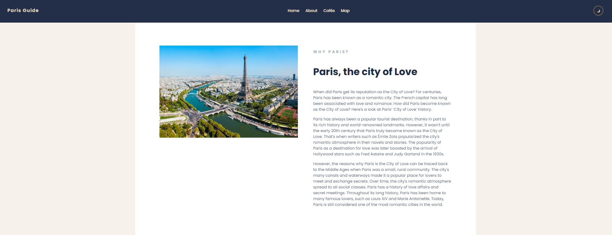
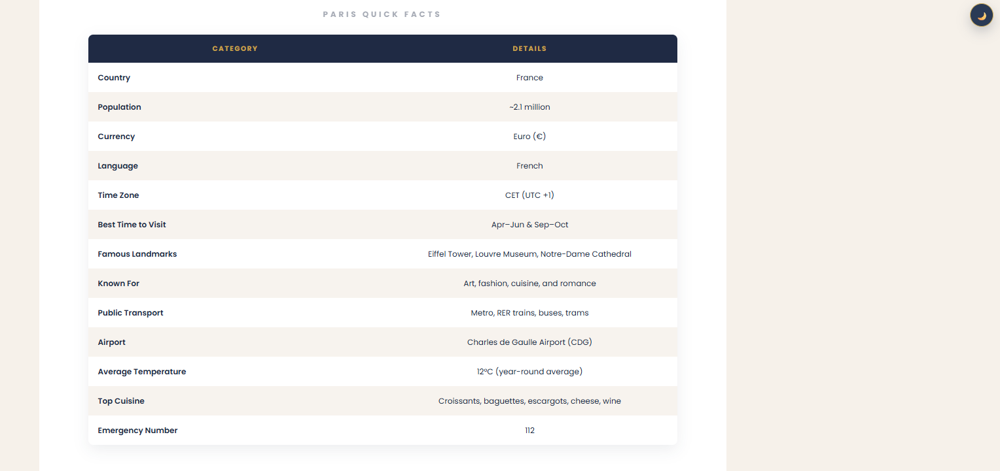
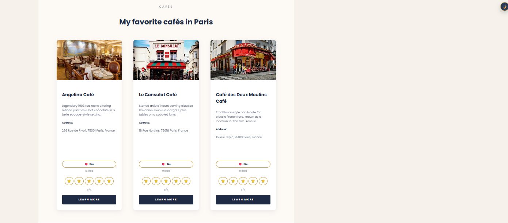
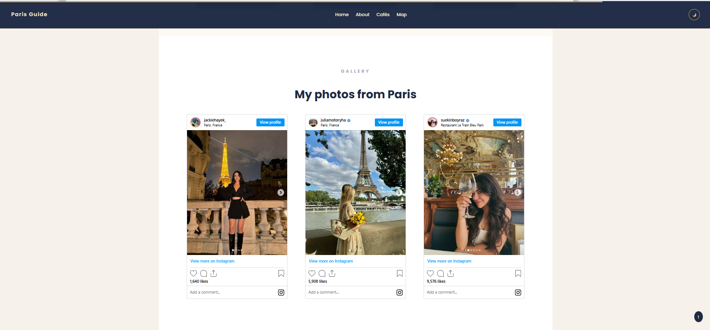
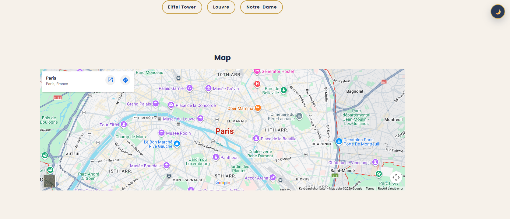

# responsive-travel

## 📌 Description
Responsive Travel is a modern, responsive travel website dedicated to the city of Paris 🇫🇷 — the “City of Love”.

It showcases iconic landmarks, cultural insights, cafés, live weather, and an interactive gallery experience using embedded Instagram posts. The project focuses on clean UI design, responsiveness, and interactive front-end features.

## 🛠 Prerequisites
* A modern web browser (Chrome, Firefox, Edge)
* A valid Instagram account (optional, for testing embeds)
* Public Instagram post links for embedding content
* Internet connection (required for Instagram embeds and Google Fonts)

## 📋 Features
* Modern and responsive design for multiple screen sizes
* Fully responsive layout optimized for mobile, tablet, and desktop
* Clean Paris-inspired aesthetic (navy + gold + cream theme)
* Information about Paris as a city of love
* Presentation of iconic cafés in Paris
* Café showcase with images, descriptions, addresses, and links
* Usage of Google Fonts (Poppins) and custom styles
* Custom typography for better visual experience
* Embed images directly from Instagram
* Embedded Instagram posts load properly
* Minimal external dependencies (Vanilla JS approach)
* Fast page load time
* Structured content architecture (sections, footer, etc.)
* Reusable grid and card-based UI components
* Smooth hover effects and micro-interactions
* Information-rich interactive features

 ## 💻 Technologies Used
The application is built with the following technologies:
* HTML
* CSS
* Google Fonts
* JavaScript (for Instagram embed functionality)
* Instagram Embed API
* Open-Meteo Weather API
* Google Maps Embed

## 🚀 Installation
No installation is required to use the app. It is hosted online and can be accessed via a web browser.

## 📚 Usage
1. Open the website in a browser
2. Explore Paris highlights and history
3. View cafés and interact with likes & ratings
4. Check live weather and time in Paris
5. Browse Instagram gallery and map section

## 🔗 Live Demo & Repository
Application can be viewed here: 
* [Live](https://ya-responsive-travel.netlify.app/)

* [Repository](https://github.com/yvonnesarah/responsive-travel)

## 🖼 Screenshot(S)
Before Design

Travel to Paris

Paris Cafes

Paris Gallery

After Design

Travel Paris Time & Weather

Travel Paris Weather - Dark Theme

Travel to Paris

Travel Paris Facts

Paris Cafes

Paris Gallery

Paris Map

## 🗺️ Roadmap (Planned Features)
* Dark mode / light mode toggle ✅
* Theme preference saved using localStorage ✅
* Scroll-to-top button with animation ✅
* Smooth scrolling across sections ✅
* Scroll-triggered animations for sections ✅
* Enhanced Instagram gallery styling system ✅

## 🚀 Upcoming Features
* Real-time clock showing Paris time ✅
* Automatic timezone conversion (Europe/Paris) ✅
* Weather integration using Open-Meteo API ✅
* Multi-day weather forecast ✅
* Dynamic weather icons based on conditions ✅
* “Feels like” temperature + comfort level indicator ✅
* Interactive Google Maps integration ✅
* Quick navigation to landmarks (Eiffel Tower, Louvre, Notre-Dame) ✅

User interaction system:
* Like system for café cards ✅
* Star rating (1–5) system ✅
* Data persistence using localStorage ✅

## 🧠 Advanced Features (Professional Level)
* Scroll-triggered fade-in animations ✅
* Smooth transitions across UI components ✅
* Optimized font loading with preconnect ✅
* Lightweight, dependency-free architecture (Vanilla JS) ✅
* Modular and readable JavaScript functions ✅
* Reusable UI components (cards, grids, buttons) ✅
* Clean separation of HTML, CSS, and JavaScript ✅

## 👥 Credit
Designed and developed by Yvonne Adedeji.

This project makes use of the following resources:

* Instagram Embed API – for displaying embedded social media posts

* Google Fonts – for typography and improved visual design

* Weather data from Open-Meteo

* Maps from Google Maps

## 📜 License
This project is open-source. For licensing details, please refer to the LICENSE file in the repository.

## 📬 Contact
You can reach me at 📧 yvonneadedeji.sarah@gmail.com.
